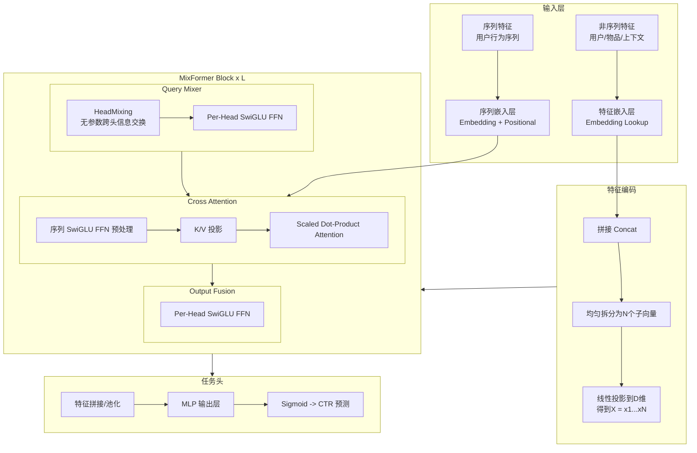

## 用户需求

使用原生 PyTorch（版本 2.10）从零实现论文 "MixFormer: Co-Scaling Up Dense and Sequence in Industrial Recommenders"（arXiv:2602.14110）中提出的 MixFormer 推荐系统模型，支持训练和推理。

## 产品概述

MixFormer 是一种专为工业推荐系统设计的统一 Transformer 风格架构，在单个骨干网络中联合建模用户行为序列和稠密特征交互，解决传统推荐模型中序列建模与特征交互分离导致的协同扩展困难问题。

## 核心功能

1. **完整模型架构实现**：包含 Dense Feature Encoding（特征嵌入与拆分）、MixFormer Block（Query Mixer + Cross Attention + Output Fusion）、任务头（CTR 预测）
2. **MixFormer Block 三大核心模块**：

- Query Mixer (QM)：基于 HeadMixing 的无参数跨头信息交换 + Per-Head SwiGLU FFN
- Cross Attention (CA)：用非序列特征 Query 聚合用户历史序列
- Output Fusion (OF)：Per-Head SwiGLU FFN 深度融合输出

3. **User-Item Decoupling（UI-MixFormer）**：用户-物品解耦变体，通过掩码矩阵实现用户侧计算可复用，降低推理延迟
4. **训练流程**：支持 BCE Loss、RMSProp/Adagrad 优化器、可配置 batch size 和模型规模（small/medium）
5. **推理流程**：支持标准推理和解耦推理（UI-MixFormer），包含模型保存与加载
6. **合成数据生成**：提供合成推荐数据集用于验证模型训练和推理流程的正确性
7. **多模型配置**：支持 MixFormer-small (N=16, L=4, D=386) 和 MixFormer-medium (N=16, L=4, D=768) 两种预设配置

## 技术栈

- **语言**: Python 3.10+
- **深度学习框架**: PyTorch 2.10（原生实现，不依赖第三方推荐库）
- **数据处理**: NumPy
- **配置管理**: dataclasses（Python 内置）
- **日志**: Python logging 模块
- **训练工具**: tqdm（进度条）

## 实现方案

### 总体策略

严格按照论文描述，使用原生 PyTorch 从底层模块逐层构建 MixFormer 架构。整体采用自底向上的实现策略：先实现基础组件（SwiGLU FFN、RMSNorm），再实现三大核心模块（Query Mixer、Cross Attention、Output Fusion），然后组装为 MixFormer Block，最后构建完整模型并配置训练/推理流程。

### 关键技术决策

1. **SwiGLU FFN 实现**：采用论文标准 SwiGLU 激活 `SwiGLU(x) = (W1·x) ⊙ SiLU(W_gate·x)`，中间维度默认为 `8/3 * D` 并向上取整到最近的 64 的倍数（对齐标准做法），以获得较好的计算效率。

2. **HeadMixing 实现**：论文描述为无参数的跨头信息交换。实现为将输入 `[N, D]` 转置为 `[D, N]` 再通过 reshape 操作混合，使得不同头的信息可以在无额外参数的情况下交互。具体而言，将 `(batch, N, D)` reshape 为 `(batch, D, N)` 再 reshape 回 `(batch, N, D)`，实现跨头维度的信息流动。

3. **Normalization 选择**：采用 RMSNorm（与现代 Transformer 实践一致，且论文公式中使用 Norm 表示），PyTorch 2.10 内置 `torch.nn.RMSNorm` 可直接使用。

4. **Per-Head FFN 设计**：每个头有独立的 SwiGLU FFN 参数。为避免 N 个独立 FFN 导致的效率问题，使用分组线性变换（将 N 个头的计算打包为一次矩阵运算），通过 `(batch, N, D)` 的批量矩阵乘法实现并行化。

5. **User-Item Decoupling 掩码**：按论文公式实现掩码矩阵，在 Query Mixer 的 HeadMixing 输出上按元素乘以掩码，阻断物品信息到用户头的信息流。

6. **模型配置**：使用 Python dataclasses 定义 `MixFormerConfig`，支持 small/medium 两种预设，参数可自由调整。

### 性能考量

- Cross Attention 中的 softmax 计算使用 `torch.nn.functional.scaled_dot_product_attention`（PyTorch 2.x 内置 FlashAttention 加速）
- 序列侧 SwiGLU FFN 对所有时间步并行计算，避免逐步循环
- 训练时使用 `torch.amp` 混合精度训练支持（可选开启）
- 推理时支持 `torch.no_grad()` 和 `model.eval()` 标准流程

## 实现注意事项

1. **维度对齐**：非序列特征拼接后总维度 `D_ns` 必须能被头数 `N` 整除，需要在配置中做校验；投影后每个头维度为 `D`（模型隐藏维度）。
2. **序列特征处理**：序列中每个时间步的特征嵌入维度也需为 `N*D`，以便拆分为 N 个头进行 Cross Attention。
3. **残差连接**：所有模块（QM、CA、OF）均包含残差连接，严格按论文公式实现。
4. **初始化策略**：线性层使用 Xavier 初始化，嵌入层使用正态分布初始化（std=0.02）。
5. **合成数据**：生成包含类别特征（用户ID、物品ID、类目等）和序列特征（用户历史点击序列）的合成数据集，用于端到端验证。

## 架构设计

### 系统架构



### 模块划分

- **config**: 模型配置（MixFormerConfig dataclass，预设 small/medium）
- **modules**: 基础组件（SwiGLUFFN、RMSNorm、HeadMixing）
- **layers**: MixFormer Block（QueryMixer、CrossAttention、OutputFusion）
- **model**: 完整模型（MixFormer、UI-MixFormer）
- **data**: 数据集与数据加载（合成数据生成、Dataset、DataLoader）
- **train**: 训练器（Trainer 类，支持训练循环、验证、checkpoint）
- **inference**: 推理器（标准推理 + 解耦推理）

### 数据流

```
用户请求 -> 特征提取 -> 嵌入编码 -> 特征拆分/投影 -> [MixFormer Block x L] -> 任务头 -> CTR 预测
                                                              |
                                                    用户行为序列 (K/V) ---> Cross Attention
```

## 目录结构

```
MixFormer/
├── README.md                    # [NEW] 项目说明文档。包含项目介绍、论文引用、安装说明、使用方法（训练和推理命令示例）、模型配置说明、项目结构概览。
├── requirements.txt             # [NEW] Python 依赖声明。列出 torch>=2.10、numpy、tqdm 等依赖包及版本要求。
├── mixformer/
│   ├── __init__.py              # [NEW] 包初始化。导出 MixFormer、UIMixFormer、MixFormerConfig 等核心类。
│   ├── config.py                # [NEW] 模型配置模块。使用 dataclass 定义 MixFormerConfig，包含 num_heads(N)、num_layers(L)、hidden_dim(D)、num_non_seq_features(M)、seq_length(T)、embedding_dims 等参数，提供 small() 和 medium() 类方法返回预设配置，包含参数校验逻辑。
│   ├── modules.py               # [NEW] 基础组件模块。实现 SwiGLUFFN（SwiGLU 激活的前馈网络，支持自定义中间维度）、HeadMixing（无参数跨头信息交换操作，通过转置和重塑实现）、PerHeadSwiGLUFFN（N 个头并行的 SwiGLU FFN，使用分组计算提升效率）。
│   ├── layers.py                # [NEW] MixFormer Block 层实现。实现 QueryMixer（HeadMixing + PerHead FFN + 残差连接 + RMSNorm）、CrossAttention（序列 SwiGLU 预处理 + K/V 投影 + Scaled Dot-Product Attention + 残差连接）、OutputFusion（PerHead FFN + 残差连接 + RMSNorm）、MixFormerBlock（组装 QM + CA + OF 三个子模块）。
│   ├── model.py                 # [NEW] 完整模型实现。实现 FeatureEncoder（非序列特征嵌入、拼接、拆分、投影；序列特征嵌入）、MixFormer（完整模型：FeatureEncoder + L 层 MixFormerBlock + TaskHead，forward 方法接受非序列特征字典和序列特征张量）、UIMixFormer（用户-物品解耦变体：继承 MixFormer 并添加掩码矩阵逻辑，支持 encode_user/encode_item 分离接口）、TaskHead（MLP + Sigmoid 输出 CTR 预测概率）。
│   └── data.py                  # [NEW] 数据处理模块。实现 SyntheticRecDataset（合成推荐数据集生成器，生成随机类别特征和用户行为序列，支持自定义特征数量和序列长度）、create_dataloader（创建 DataLoader 的工厂函数，配置 batch_size、shuffle、num_workers 等参数）。
├── train.py                     # [NEW] 训练入口脚本。实现 Trainer 类（封装训练循环、验证循环、指标计算 AUC/LogLoss、学习率调度、混合精度训练支持、模型 checkpoint 保存/加载、日志记录），main 函数解析命令行参数（模型配置、训练超参数、数据参数），创建模型和数据集并启动训练。支持 --config small/medium 快速切换模型规模。
├── inference.py                 # [NEW] 推理入口脚本。实现标准推理流程（加载 checkpoint、构建模型、批量预测）和 UI-MixFormer 解耦推理流程（用户侧编码缓存 + 物品侧快速打分），输出预测 CTR 值，支持命令行参数指定 checkpoint 路径和推理模式。
└── tests/
    └── test_model.py            # [NEW] 单元测试。测试各模块维度正确性（SwiGLUFFN、HeadMixing、QueryMixer、CrossAttention、OutputFusion、MixFormerBlock 的输入输出 shape）、完整模型前向传播（MixFormer 和 UIMixFormer）、梯度反向传播是否正常、配置校验逻辑、合成数据集生成。
```

## 关键代码结构

```python
@dataclass
class MixFormerConfig:
    """MixFormer 模型配置"""
    num_heads: int = 16           # N: 头数
    num_layers: int = 4           # L: MixFormer Block 层数
    hidden_dim: int = 386         # D: 每个头的隐藏维度
    seq_length: int = 50          # T: 用户行为序列最大长度
    num_non_seq_features: int = 50  # M: 非序列特征数量
    feature_embed_dim: int = 16   # 每个特征的嵌入维度
    num_items: int = 10000        # 物品词表大小
    num_users: int = 10000        # 用户词表大小
    vocab_sizes: dict = None      # 各类别特征的词表大小映射
    ffn_multiplier: float = 2.667 # SwiGLU FFN 中间维度倍数 (8/3)
    dropout: float = 0.0          # Dropout 概率
    # UI-MixFormer 解耦参数
    user_heads: int = 8           # N_U: 用户侧头数
    item_heads: int = 8           # N_G: 物品侧头数

    @classmethod
    def small(cls) -> "MixFormerConfig": ...
    
    @classmethod
    def medium(cls) -> "MixFormerConfig": ...
```

```python
class MixFormerBlock(nn.Module):
    """单个 MixFormer Block: QueryMixer -> CrossAttention -> OutputFusion"""
    def __init__(self, config: MixFormerConfig): ...
    def forward(
        self,
        x: torch.Tensor,          # 非序列特征头 (batch, N, D)
        seq: torch.Tensor,         # 序列特征 (batch, T, N*D)
        seq_mask: torch.Tensor = None  # 序列 padding mask (batch, T)
    ) -> torch.Tensor:             # 输出 (batch, N, D)
        ...
```

```python
class MixFormer(nn.Module):
    """完整 MixFormer 推荐模型"""
    def __init__(self, config: MixFormerConfig): ...
    def forward(
        self,
        non_seq_features: dict[str, torch.Tensor],  # 非序列特征 {name: (batch,)}
        seq_features: torch.Tensor,                   # 序列物品ID (batch, T)
        seq_mask: torch.Tensor = None,                # 序列 mask (batch, T)
    ) -> torch.Tensor:                                # CTR 预测 (batch, 1)
        ...
```

## Agent Extensions

### SubAgent

- **code-explorer**
- 用途：当前项目为空目录无需探索，但在实现过程中如需参考其他项目的 PyTorch 实现模式可使用此 subagent
- 预期结果：快速定位参考代码和模式